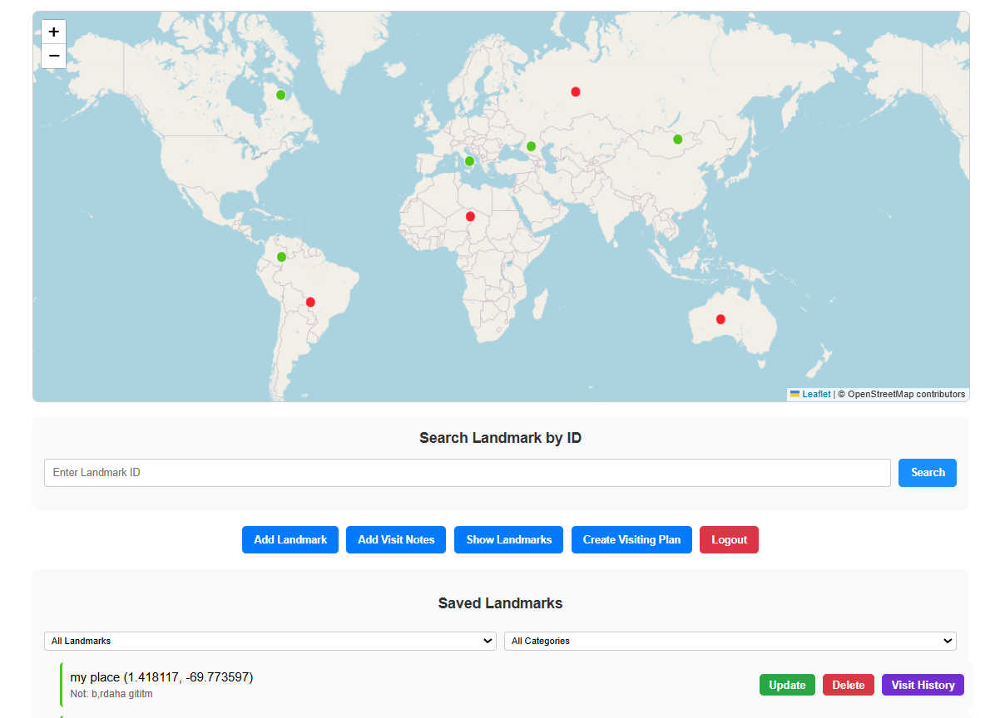

# Landmark Management System

A web-based application for managing landmarks, recording visits, and creating visiting plans. This system allows users to add landmarks to a map, categorize them, track visits, and organize future explorations.



## Features

- **Interactive Map**: Leaflet-based map interface for visualizing and interacting with landmarks
- **Landmark Management**: Add, update, and delete landmarks with names, categories, and notes
- **Visit Tracking**: Record visits to landmarks with visitor names and dates
- **Visit History**: View complete visit history for each landmark
- **Search Functionality**: Find landmarks by ID with quick access to details
- **Filtering**: Filter landmarks by visit status and category
- **Visiting Plans**: Create custom plans with multiple landmarks for future visits
- **User Authentication**: Secure user login to track personal visits (in development)

## Technologies Used

- **Frontend**:
  - HTML5, CSS3, JavaScript
  - Leaflet.js for interactive maps
  - Responsive design for various screen sizes

- **Backend**:
  - Node.js with Express.js
  - MySQL database for data storage
  - RESTful API architecture

## Database Structure

The system uses the following database tables:

- `landmarks`: Stores landmark information (coordinates, name, category, notes)
- `visited_landmarks`: Records of landmark visits
- `users`: User authentication information
- `user_visits`: User-specific landmark visit records
- `visiting_plans`: Saved plans for future visits
- `landmarks_of_plan`: Landmarks included in specific plans

## Installation

### Prerequisites

- Node.js (v14 or higher)
- MySQL (v8 or higher)
- Web browser with JavaScript enabled

### Setup

1. **Clone the repository**
   ```
   git clone https://github.com/yourusername/landmark-management-system.git
   cd landmark-management-system
   ```

2. **Install dependencies**

   ```
   cd backend
   npm install
   ```

3. **Set up the database**
   - Create a MySQL database
   - Import the SQL schema from `database/schema.sql`
   ```
   mysql -u username -p your_database_name < database/schema.sql
   ```

4. **Configure environment variables**
   - Create a `.env` file in the root directory
   - Add your database connection details:
   ```
   DB_HOST=localhost
   DB_USER=your_username
   DB_PASSWORD=your_password
   DB_NAME=your_database_name
   PORT=3000
   ```

5. **Start the server**
   ```
   npm start
   ```

6. **Access the application**
   - Open your browser and navigate to `http://localhost:3000`

## API Endpoints

The system provides the following API endpoints:

### Landmarks
- `GET /landmarks` - Get all landmarks
- `GET /landmarks/:id` - Get a specific landmark
- `POST /landmarks/adding` - Add a new landmark
- `PUT /landmarks/:id` - Update a landmark
- `DELETE /landmarks/:id` - Delete a landmark

### Visits
- `GET /visited_landmarks` - Get all visited landmarks
- `GET /visited_landmarks/:id` - Get visit history for a specific landmark
- `POST /visited_landmarks/notes` - Add a visit record

### Plans
- `POST /create_plan` - Create a new visiting plan

### Users (in development)
- `POST /users/register` - Register a new user
- `POST /users/login` - User login
- `GET /user_visits/:userId` - Get visits for a specific user

## Usage

### Adding a Landmark
1. Click the "Add Landmark" button
2. Click on the map to place a marker
3. Fill in the landmark details (name, category)
4. Click "Save Landmark"

### Recording a Visit
1. Click the "Add Visit Notes" button
2. Select a landmark from the dropdown
3. Enter your name and the visit date
4. Add any notes about your visit
5. Click "Save Visit"

### Creating a Visiting Plan
1. Click the "Create Visiting Plan" button
2. Click on the map to add points to your plan
3. For each point, enter a name, select a category, and add optional notes
4. Enter a name for your plan
5. Click "Save Visiting Plan"

### Viewing Landmarks
1. Click the "Show Landmarks" button to see all landmarks
2. Use the filter options to narrow down by category or visit status
3. Click on markers or list items to see details

### Searching for a Landmark
1. Enter a landmark ID in the search field
2. Click "Search" to find and display the landmark

## Contributing

Contributions are welcome! Please feel free to submit a Pull Request.

1. Fork the repository
2. Create your feature branch (`git checkout -b feature/amazing-feature`)
3. Commit your changes (`git commit -m 'Add some amazing feature'`)
4. Push to the branch (`git push origin feature/amazing-feature`)
5. Open a Pull Request


## Contact

Your Name - fzehraozturk@gmail.com

Project Link: https://github.com/zehraozturkk/landmark-notes-map